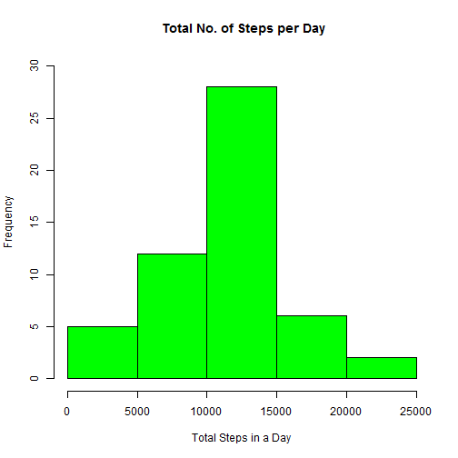
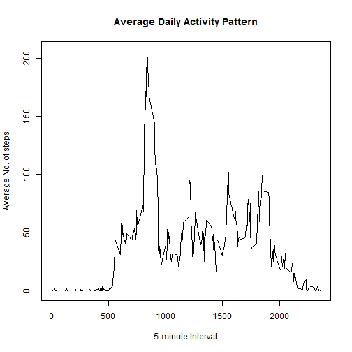
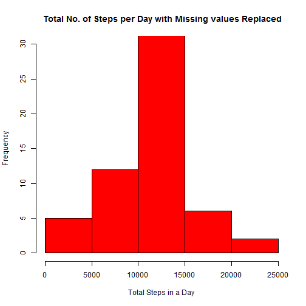
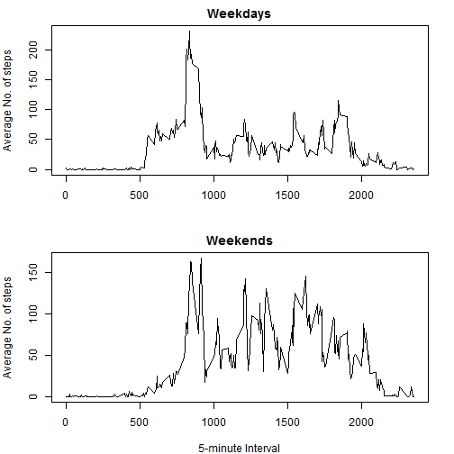

# Reproducible Research - Assignment 1

## Introduction

Now a days a large amount of data about personal movement is collected using activity monitoring devices such as a Fitbit, Nike Fuelband, or Jawbone Up. These devices are used by a group of enthusiasts who take measurements about themselves regularly to improve their health, to find patterns in their behavior, or because they are tech geeks. But these data remain under-utilized both because the raw data are hard to obtain and there is a lack of statistical methods and software for processing and interpreting the data.

In this assignment we make use of data collected from a personal activity monitoring device. This device collects data at 5 minute intervals through out the day. The data consists of two months of data from an anonymous individual collected during the months of October and November, 2012 and include the number of steps taken in 5 minute intervals each day. A data analysis is conducted to study the activity patterns of this individual. 

## Data

The dataset for this analysisis is stored in a comma-separated-value (CSV) file and there are a total of 3 variables and 17,568 observations in this dataset. The variables included are:

steps: Number of steps taking in a 5-minute interval (missing values are coded as NA)

date: The date on which the measurement was taken in YYYY-MM-DD format

interval: Identifier for the 5-minute interval in which measurement was taken. 

The identifiers take values 0, 5, 10, 15,...55, 100, 105, ... 155, 200, 205,...255, 300,....2355.  An ID of 830 means that the reading was taken at 8.30. Thus there are 288 observations recorded per day and 61 days in total for which data was collected resulting in 61* 288 = 17568 observations.

## Assignment
There assignment is done in multiple parts as follows. For each part the report and code that is used is included alongwith it:

- **Loading and preprocessing the data**

Here the data is read as a csv file into R. The only preprocessing that is done is to convert the date variable which was given as a character class into a date class.
 

```r
 # read the dataset
amd <- read.csv("activity.csv")
# format the date as a date class
amd$date <- as.Date(x = amd$date, format = "%Y-%m-%d")
```

- **Mean total number of steps taken per day** 

For this part of the assignment, the missing values in the dataset are ignored. First we make a histogram for the total number of steps taken each day. Further, we also calculate the mean and median of the total number of steps taken per day. For both these calculations the missing values are ignored.


```r
#calculate the total steps
total_steps <- aggregate(amd$steps ~ amd$date, data = amd, sum)
colnames(total_steps) <- c("Date", "Steps")
#plot the histogram
hist(total_steps$Steps, col = "green", main = paste(" Total No. of Steps per Day"), ylim = c(0, 30), xlab = "Total Steps in a Day")
```

 

```r
#calculate the mean and median
mean_data <- mean(total_steps$Steps, na.rm = TRUE)
median_data <- median(total_steps$Steps, na.rm = TRUE)
mean_data
```

```
## [1] 10766.19
```

```r
median_data
```

```
## [1] 10765
```

The mean value is 1.0766189 &times; 10<sup>4</sup> and the median value is 10765. The mean is the average number of total steps taken by the individual in a day. Since missing values are ignored, only those days have been counted where some data have been collected. As expected both the mean and median values are close to each other.

- **Average daily activity patern**

To detremine the average daily activity pattern we construct a time series plot. For this, we calculate the average number of steps taken on all days in a 5- minute interval. The plot has the 5-minute interval on the x-axis and the average number of steps taken, averaged across all days on the y-axis. We also answer the question as to which 5-minute interval, on average across all the days in the dataset, contains the maximum number of steps.


```r
mean_steps <- aggregate(amd$steps ~ amd$interval, data = amd, mean)
colnames(mean_steps) <- c("Interval", "Ave_steps")
# time-series plot
plot(mean_steps$Interval, mean_steps$Ave_steps, type = "l", xlab = "5-minute Interval", ylab = "Average No. of steps", main= "Average Daily Activity Pattern")
```

 

```r
# finding the max value
m <- max(mean_steps$Ave_steps)
# five minute interval that contains the maximum average steps
int <- mean_steps[which(mean_steps$Ave_steps == m), "Interval"]
int
```

```
## [1] 835
```

Looking at the time series plot for the average daily activiy across all days, we see that the maximum activity takes place between 8 and 10 in the morning. This could indicate that the subject is in the habit of exercising in the morning. A moderate amount of activity is seen between 10 in the morning to 8 in the evening. This might be corresponding to the normal daily activity of the subject like sitting standing etc. As is expected, there is mor or less zero activity late night and early morning.

The time interval that corresponds to the maximum number of steps  is 835. The maximum number of steps during the 835 time interval is given by 206.1698113. this is consitent with our observation of the time series plot.

- **Input missing values**

There were a number of days/intervals where there are missing values. For the frst few questions, these values were ignored. However, the presence of missing days may introduce bias into some calculations or summaries of the data. In this section we will first calculate the total number of missing values in the dataset.


```r
# total no. of missing values
na_values <- length(which(is.na(amd$steps)== TRUE))
na_values
```

```
## [1] 2304
```
 
 We see that the total number of missing values is 2304. This couple of thousand values is not small. Hence, it makes sense to fill in all of the missing values in the dataset. The strategy that is used is to replace the missing vlaues by the mean for that 5-minute interval averaged across all days. 
A new dataset is created, denoted by "amd_r" in the code, that is equal to the original dataset but with the missing data filled in. Next a histogram of the total number of steps taken each day is plotted and we also calculate the mean and median of the total number of steps taken per day. 


```r
amd_r <- amd
index <- which(is.na(amd$steps), arr.ind = TRUE)
for (i in 1: length(index)){
        amd_r[index[i],1] <- mean(subset(amd_r$steps, amd_r$interval == amd_r[index[i],3]), na.rm= TRUE)
}
#calculate the total steps
total_steps_r <- aggregate(amd_r$steps ~ amd_r$date, data = amd_r, sum)
colnames(total_steps_r) <- c("Date", "Steps")
#plot the histogram
hist(total_steps_r$Steps, col = "red", main = paste(" Total No. of Steps per Day with Missing values Replaced"), ylim = c(0, 30), xlab = "Total Steps in a Day")
```

 

```r
#calculate the mean and median
mean_r <- mean(total_steps_r$Steps)
median_r <- median(total_steps_r$Steps)
mean_r
```

```
## [1] 10766.19
```

```r
median_r
```

```
## [1] 10766.19
```

As is seen, there is not any significant noticeable difference between the two histograms. We also observe that for the mean and median values for this new dataset is 1.0766189 &times; 10<sup>4</sup> and 1.0766189 &times; 10<sup>4</sup>. These values are also **same** or very **close** to the values of mean and median obtained where missing values were ignored. Thus there is **no** or **hardly any** impact on the estimates by inputting missing data.

- **Difference between weekdays and weekends**

Lastly, we create a new factor variable in the dataset with two levels – “weekday” and “weekend” indicating whether a given date is a weekday or weekend day. This is to observe the differnce in the activity pattern between weekdays and weekends. Please note that for the purpose of this assigment, Saturday and Sunday have been considered as weekends. We also make a panel plot containing a time series plot for both the weekdays and the weekends. As before, the 5-minute interval is taken on the x-axis and the average number of steps taken, averaged across all weekday days or weekend days is on the y-axis. 


```r
# finding the weekdyas
amd_w <- cbind(amd_r, weekdays(amd[,2]))
colnames(amd_w) <- c("steps", "date", "interval", "weekday")
## separating the dataset into weekdays and weekends
amd_w[,4] <- as.character(amd_w[,4])
for (i in 1: nrow(amd_w)){
        if(amd_w[i,4] %in% c("Saturday", "Sunday")){
                amd_w[i,4] <- "weekend"
        } 
        else {
                amd_w[i,4] <- "weekday"
        }
}
amd_w[,4] <- factor(amd_w[,4])
amd_wend <- subset(amd_w, amd_w$weekday == "weekend")
amd_wday <- subset(amd_w, amd_w$weekday == "weekday")
# average no of steps on weekdays and weekends
steps_wend <- aggregate(amd_wend$steps ~ amd_wend$interval, data = amd_wend, mean)
steps_wday <- aggregate(amd_wday$steps ~ amd_wday$interval, data = amd_wday, mean)
colnames(steps_wend) <- c("interval", "steps")
colnames(steps_wday) <- c("interval", "steps")
##plotting the graph
par(mfrow = c(2, 1), mar = c(4,4,2,2))
with(amd_w,{
        plot(steps_wday$interval, steps_wday$steps, type = "l", xlab = "" , ylab = "Average No. of steps", main= "Weekdays")
        plot(steps_wend$interval, steps_wend$steps, type = "l", xlab = "5-minute Interval", ylab = "Average No. of steps", main= "Weekends") 
})
```

 

The plots show that on weekdays there is a peak time of activity in 8-10 interval in the morning. Where as on weekends, there is no one such peak that stands out.
